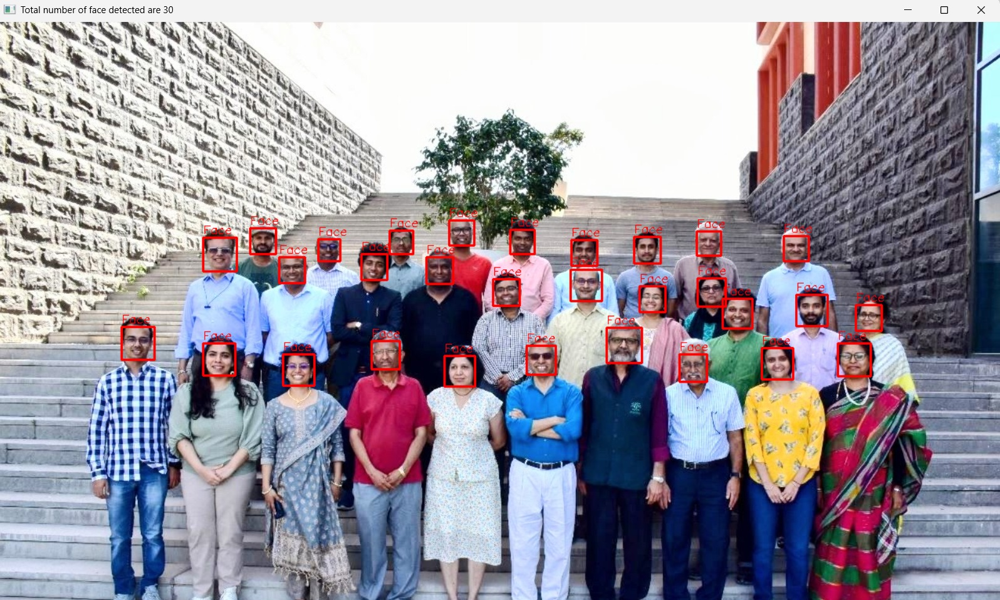
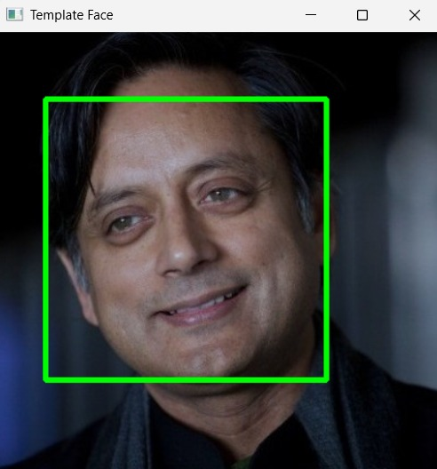

# Face clustering using distance based classification

# overview
The aim of this project is to detect faces in an image and cluster them based on visual similarity using K means clsutering. This extracts colour features from the detected faces and group similar faces into clustering using distance metrics.

# AIM
The aim of this project is to: 
1) Detect faces in an image using OpenCV
2) Extract feature representations from the detected faces
3) Apply KMeans clustering using distance based similarity
4) Visualize clusters in feature space
5) Classify new template face into an existing cluster

# METHODOLOGY
The project follows these steps:
1) Face detection: Haar cascade classifier is used to detect faces and bounding boxes are drawn around the detected faces
2) Feature Extraction: Faces are converted from BGR to HSV colour space. Then the mean hue and saturation values are extracted. These values represent each face as a 2d feature vector.
3) Clustering: K means clsutering is applied to group the faces. Distance metrics are used to determine similarity. Cluster centroids are calculated.
4) Visualization: Scatter plots display clustering results.

# VISUAL RESULTS

  
  

<em>Before vs After Detection</em>

  
  

# KEY FINDINGS
1) Distance based similarity effectively groups visually similar faces.
2) HVS colour features provide meaningful clustering
3) K-Means clustering separates faces into distinct groups

## Conclusion

This project demonstrates how distance-based classification techniques can be applied to real-world computer vision problems. By combining face detection, feature extraction, and clustering, the system successfully groups similar faces and classifies new inputs.

The experiment highlights the importance of choosing appropriate distance metrics and visualization for understanding machine learning behavior.
